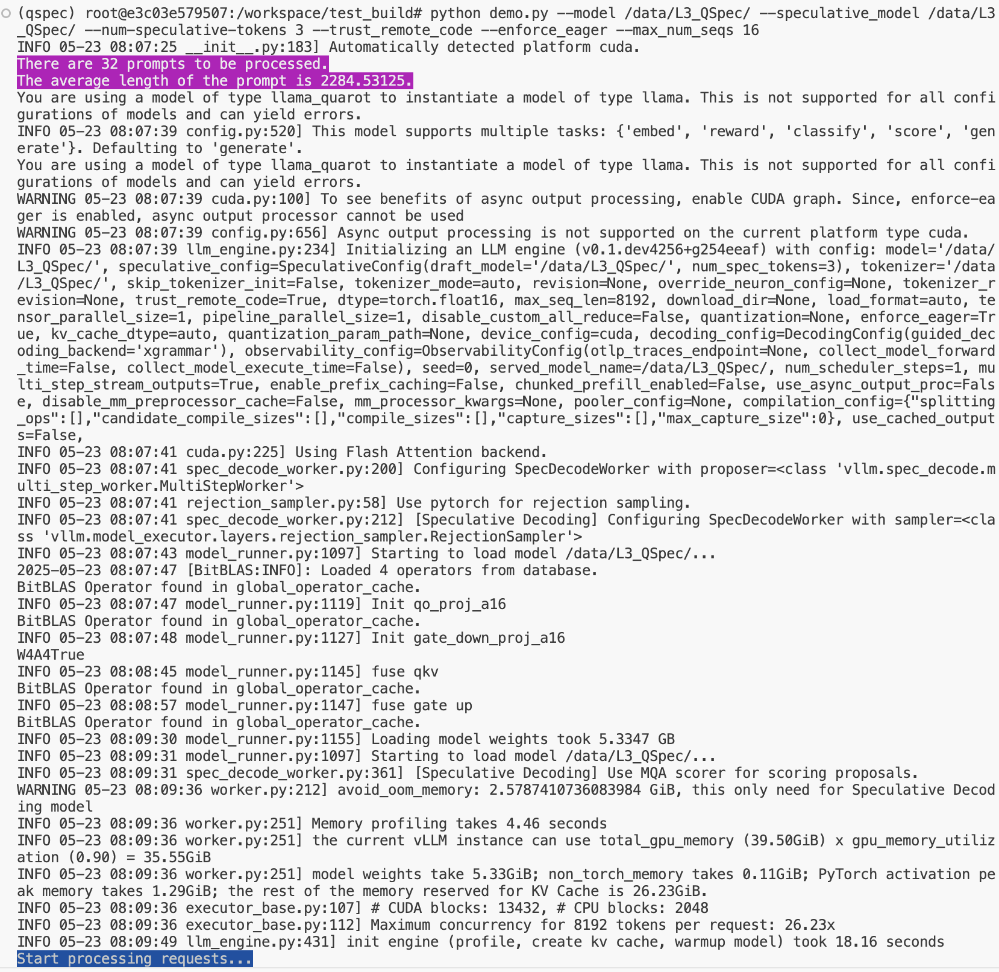
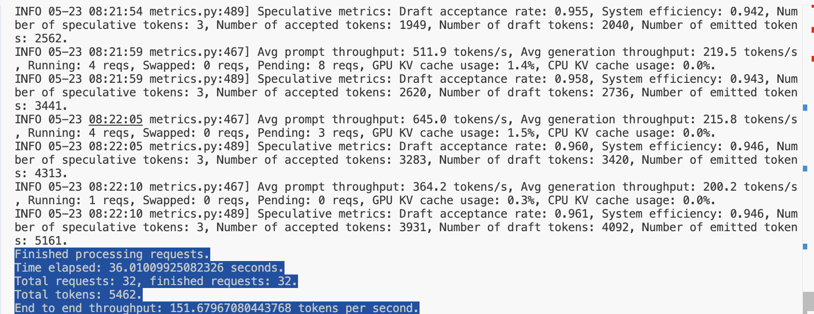
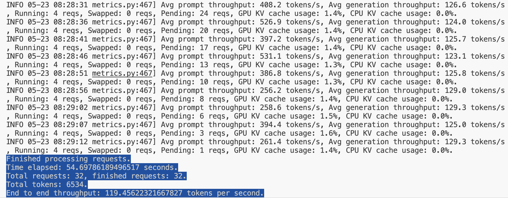

# QSpec Official Implementation v0.0 
This is the official implementation of the QSpec: Speculative Decoding with Complementary Quantization Schemes. Leveraging nearly cost-free execution switching, QSpec drafts tokens with low-precision, fast activation-weight quantization, and verifies them with high-precision weight-only quantization, effectively combines the strengths of both quantization schemes.

## Installation
### Prerequisites
- CUDA 12.5
- Python 3.10
- NVIDIA A100 40GB or L20 48GB
- Note that QSpec is not tested on other GPUs, but it should work on other NVIDIA GPUs with SM 8.0 or higher.
- The QSpec is not tested on other CUDA versions.

### Optional: Docker
Highly recommended to use a **virtual** environment and **a Docker container** for the installation and tests. The docker image is based on the official NVIDIA container, if you want to use the image, please refer to the docker directory. 

* First, please modify the MOUNT_PATH in docker/mount_path.txt to QSpec repository path. 
* Second, please modify the DATA_PATH in docker/run_mt.sh to your data path. 
* Third, run the docker image with the following command. 
```bash
bash docker/build.sh
bash docker/run_mt.sh
```
### QSpec Installation
1. Clone the repository, and login to Huggingface by CLI.
2. CUDA 12.5 and python 3.10 are required.
3. **GLIBCXX_3.4.30 is required**. If you are using a system with an older version of GLIBCXX, you can use the following command to install the required version. ``` conda install -c conda-forge libstdcxx-ng ```

```bash
bash install.sh # this will also install the dependencies and QSpec Kernels, the download and compile tasks usually take up to 40 minutes due to the vLLM and CUTLASS projects' long compilation time, and the actual time may vary depending on the machine.
```

## Getting Started
**The QSpec serving script is in ./demo.py.** 
1. Download the QSpec model from Huggingface hub copy the path to the model.
```bash
git lfs install
git clone https://huggingface.co/AnonymousResearcher2025/Llama3_8B_Instruct_QSpec
```
2. Users can use demo.py to check the throughput of QSpec on their own machine.
```bash
# QSpec
CUDA_DEVICE_ORDER=PCI_BUS_ID python demo.py --model PATH-TO-QSPEC-MODEL  --speculative_model PATH-TO-QSPEC-MODEL(Same as the former)      --num-speculative-tokens 3   --max_num_seqs 4  --trust_remote_code --enforce_eager

# Auto-regressive W4A16 without QSpec (Baseline)
CUDA_DEVICE_ORDER=PCI_BUS_ID python demo.py --model PATH-TO-QSPEC-MODEL  --max_num_seqs 4  --trust_remote_code --enforce_eager 
```

3. Users can try other counterparts like EAGLE or N-gram etc. by changing the model name in the above commands.
```bash
CUDA_DEVICE_ORDER=PCI_BUS_ID python demo.py --model PATH-TO-QSPEC-MODEL \
    --speculative_model PATH-TO-EAGLE \
    --num-speculative-tokens 3 \
    --max_num_seqs 4 \
    --trust_remote_code --enforce_eager
```    


## Notes
- QSpec's kernels were written on CUDA 12.5. Inspired by the FlashAttention, FlashInfer, TorchAO, QuaRot and other projects, we have implemented the QSpec kernels in third-party libraries.
- QSpec is a research project and is not yet ready for production use as we have not yet optimized the performance of the kernels to the fullest extent and have not yet integrated the kernels into VLLM accordingly. We use plugins to integrate QSpec into VLLM and slightly modify the VLLM codebase to support QSpec. We will release the full version of QSpec on VLLM in the near future.
- **The first run of the QSpec model may be slow due to the auto-tuning process for linear layers on different/specific target GPUs. But the optimized kernels will be cached for future runs. It takes about 5 to 10 minutes in our machine**

## Demo Figures

- Initializing the QSpec model and vLLM framework.


- The test outputs of QSpec.



- The test outputs of the baseline model (W4A16) without QSpec.

